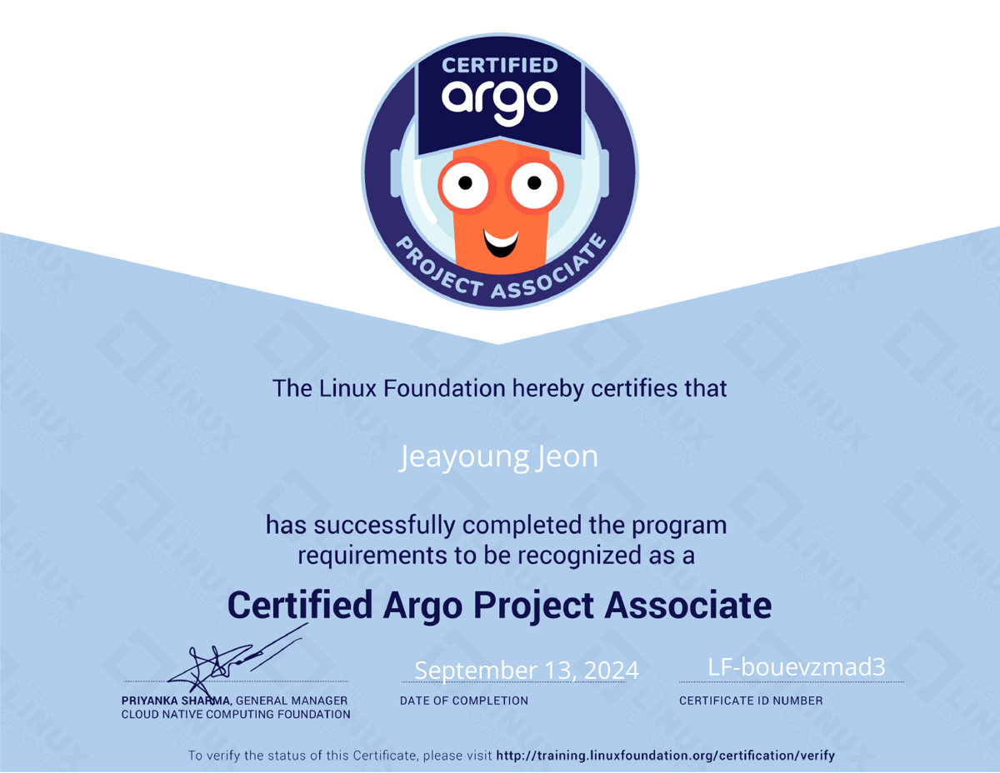

I'm sharing my experience passing the [CAPA (Certified Argo Project Associate)](https://training.linuxfoundation.org/certification/certified-argo-project-associate-capa/) exam last weekend. CAPA is a brand-new certification launched in the first half of 2024, an Associate-level exam that validates your ability to work with the [Argo Project](https://argoproj.github.io/). This post is a short introduction to the Argo Project and the CAPA certification, followed by a record of how I prepared and what I learned along the way. I hope it's useful to anyone considering or curious about CAPA 🚀

<!-- truncate -->

## 1. About the Certification

### What is the Argo Project?

<figure class="figure" style="float: right; width: 330px; max-width: 68%; margin: 0.25rem 1.0rem">
  
  <figcaption class="figcaption" style="margin-top: 0.5rem; font-size: 0.75em; color: var(--gray);">Not the official mascot — just a stuffed octopus (or "jjukkumi") toy that happens to look like one. Photo by <a href="https://unsplash.com/@cosiela?utm_content=creditCopyText&utm_medium=referral&utm_source=unsplash">Cosiela Borta</a> on <a href="https://unsplash.com/photos/a-pink-octopus-stuffed-animal-sitting-on-top-of-a-table-S3VKHlvBfMA?utm_content=creditCopyText&utm_medium=referral&utm_source=unsplash">Unsplash</a></figcaption>
</figure>

The [Argo Project](https://argoproj.github.io/) is a suite of tools that combine with Kubernetes clusters to make them behave like a single DevOps platform — and it's getting more attention as Kubernetes adoption grows. It consists of four components:

- **Argo Workflows**: An orchestration engine for general-purpose workflows, including ML and CI/CD pipelines
- **Argo CD**: A declarative continuous-deployment tool (the most well-known of the four)
- **Argo Rollouts**: A deployment-strategy manager that supports advanced update strategies
- **Argo Events**: An event-driven automation tool that reacts to code changes and other triggers

At first glance it looks like a bundle of CI/CD tools, but each component is actually designed to work generically alongside Kubernetes. You can use Argo Workflows to build data/ML pipelines instead of CI pipelines, and Argo CD to deploy Kubernetes resources — or even Argo CD itself — instead of a web server.

### What is the CAPA Certification?

The [CAPA (Certified Argo Project Associate)](https://training.linuxfoundation.org/certification/certified-argo-project-associate-capa/) exam tests your understanding and hands-on knowledge of all four Argo apps (Workflows, CD, Events, Rollouts). A few key facts:

- It's an internationally recognized technical certification administered by the CNCF and the Linux Foundation.
- It's an entry-to-intermediate Associate-level exam — there's currently no higher-level Argo certification.
- It's a live, proctored exam taken through the [PSI Secure Browser](https://test-takers.psiexams.com/) environment.
- You have 90 minutes to answer 60 multiple-choice questions, and you need 75/100 to pass. You can take it up to twice.
- It's valid for two years from the date you pass, and you'll know whether you passed within about 10 minutes of submitting.

If you've taken Kubernetes certifications like CKA, CKAD, or CKS, this exam environment will feel familiar.

## 2. My Experience

*My CAPA certification 2024. Issued on September 14, 2024, expires on September 15, 2026. You can verify it [here](https://www.credly.com/badges/ee42c2c7-2ac3-411f-8713-cc26cbec8022).*

### Why did I pursue it?

**1. I'd been actively using the Argo Project at work for two years and wanted to take stock of where I stood.**

- Used Argo Workflows as the engine for data pipelines and CI/CD pipelines
- Used Argo CD to deploy web applications and Kubernetes resources
- Adopted Argo Rollouts to manage multiple deployment strategies as code
- Used Argo Events for event sourcing in custom CI/CD setups

**2. Adoption of the Argo Project is growing in Korea, and I wanted to keep up with the industry trend.**

Companies ranging from large IT firms to unicorn AI startups — Karrot (당근), Toss, Devsisters, Sionic AI, and more — are increasingly adopting the Argo Project. I wanted to properly absorb a trending technology, and go beyond simply documenting my experience by securing a verifiable, internationally recognized credential.

### Did it actually help?

It helped a lot. I used Argo Workflows and Argo CD almost every day, but I'd never organized that knowledge systematically. Preparing for this exam gave me a chance to consolidate what I knew and fill in the gaps.

**Before passing the exam**, I was able to firm up my understanding of the design intent and use cases for all four Argo apps, and discovered hidden features in Argo Rollouts and Argo Events — the two I'd used the least. I tried out every Argo Rollouts deployment strategy (canary, blue/green, delayed rolling, custom updates, and more) and a variety of Argo Events triggers (Kubernetes resource triggers, S3 triggers, custom webhook triggers, and more). I'd only ever used the features I needed day-to-day — this was my first real chance to put to use everything the contributors had built.

**After passing the exam**, I started reading the official docs much more carefully, and kept finding features I didn't know about even in tools I used every day, like Argo Workflows and Argo CD — which surfaced a lot of things I now want to refactor. A few examples:

- [Argo Workflows SSO guest accounts](https://argo-workflows.readthedocs.io/en/stable/argo-server-sso/)
  - "Can a new hire monitor workflows without being able to delete resources?" → Yes — combine SSO with RBAC to keep initial permissions to a minimum. (This overlaps nicely with skills tested in CKA.)
- [Argo CD Sync Windows](https://argo-cd.readthedocs.io/en/stable/user-guide/sync_windows/)
  - "Can we turn off auto-sync during our Thursday-early-morning maintenance window?" → Yes — add a `deny` window for Thursdays in `syncWindows`, and syncing will be paused during that time.
- [Argo CD ApplicationSet Git Generators](https://argo-cd.readthedocs.io/en/stable/operator-manual/applicationset/Generators-Git/)
  - "Can we sync and control the incidental resources that pop up during operations?" → Yes — `ApplicationSet` lets you sync derived Kubernetes resources with subdirectories of a git repository.

In the end, this reaffirmed something true of every open-source tool: **the real skill is reading the official docs well and putting them to use.**

### How did I prepare?

Since this is such a new exam, study material is scarce. There's plenty of Korean-language material for Argo Workflows and Argo CD, but for Argo Rollouts and Argo Events I had to rely almost entirely on the official documentation.

There are barely any third-party courses, but there is an official one: [DevOps and Workflow Management with Argo (LFS256)](https://training.linuxfoundation.org/training/devops-and-workflow-management-with-argo-lfs256/). Going through it start to finish should cover the exam scope well. For some reason I bought just the exam without the course — I think I assumed that, since I was already using Argo at work, I could pass without much extra studying. That assumption cost me quite a bit of suffering. For your own sanity, I'd recommend buying the bundle when there's a discount.

I ended up self-studying with the [official documentation](https://argo-cd.readthedocs.io/) and the GitHub source code. The exam scope is laid out in the [CAPA Curriculum PDF](https://github.com/cncf/curriculum/blob/master/CAPA_Curriculum.pdf), but since it was hard to predict exactly what would show up, I studied every item in it. My first pass was a quick read-through of the docs; the second pass was implementing the parts I thought were likely to appear. Since this is a multiple-choice exam rather than a hands-on one, it's not open-book and you can't verify things by running them — so it really pays off to experiment beforehand. For experimentation, I used Kubernetes simulators like docker-desktop, kind, microk8s, and orbstack — orbstack was my go-to on macOS for spinning up clusters quickly.

### How does the exam work?

Buy the exam from the [exam page](https://training.linuxfoundation.org/certification/certified-argo-project-associate-capa/) (cheaper if you can find an event coupon), then book a date on the [Training & Certification dashboard](https://trainingportal.linuxfoundation.org/learn/dashboard). On exam day, go through the readiness checklist shown on the same dashboard (see the screenshot below), then click **Take Exam** to begin.

*The CAPA exam readiness checklist on the Linux Foundation Training & Certification dashboard.*

A few things worth knowing about how it's run:

- It's a **multiple-choice exam with 4 options per question**. There are surprisingly many obviously-wrong options, which makes the exam feel easier than expected — but there's almost always one option that looks deceptively close to the right answer, so read the English explanations carefully.
  - The difficulty felt **comparable to CKAD**. Roughly speaking, I'd rank related certifications as [KCNA](https://training.linuxfoundation.org/certification/kubernetes-cloud-native-associate/) < [CKAD](https://training.linuxfoundation.org/certification/certified-kubernetes-application-developer-ckad/) = CAPA < [CKA](https://training.linuxfoundation.org/certification/certified-kubernetes-administrator-cka/) < [CKS](https://training.linuxfoundation.org/certification/certified-kubernetes-security-specialist/).
  - To score 75, you just need to be comfortable with the core features of all four Argo apps. To score 100, you'll also need to know the names and usage of rarely-used detail features, and be able to tell apart answers that look almost — but not quite — correct.
- You take it through the [PSI Secure Browser](https://test-takers.psiexams.com/) — familiar territory if you've taken CKA, CKAD, or CKS. Do double-check supported OS versions ahead of time, though: I was running a macOS developer beta and had to roll it back at the last minute before my exam.
- **It's not open-book.** You can't access the official docs or a CLI, so there's no looking things up or verifying commands on the spot.
- You can review all 60 questions again after finishing, and there's a `review` toggle to flag the ones you're unsure about.
- You can request a short break (up to about 15 minutes) to use the restroom mid-exam, but the clock appeared to keep running during the break — so it's best to go beforehand, or be quick about it (I'd love to hear if others experienced this differently).

### What's the exam content like?

> Per the exam's terms of service, I won't describe specific questions.

- A few questions show you Argo Workflows YAML and ask you to determine the execution order — watch out, because "this can't be executed" is sometimes one of the options.
- There are more GUI-related questions than I expected, in addition to CLI ones — it's worth browsing the GUI of the latest Argo Workflows and Argo CD versions before your exam.
- Some questions test whether you know if a setting belongs at `spec.a.b`, `spec.b.a`, or `spec.c` in the YAML.
- Overall, the difficulty isn't too high — if you've used these tools in production, you should be able to pass comfortably.

A couple more tips that helped me:

- Flag any question you're unsure about with `review` and move on — you can sometimes pick up hints (e.g., correct YAML syntax) from the options in other questions.
- Since it's multiple-choice, eliminating the options you're sure are wrong improves your odds even when you have to guess.

## 3. Summary

I received my pass notification about a minute after clicking submit. I'm used to Kubernetes exams that take 24 hours to grade, so this caught me off guard — but it also meant the joy of passing arrived that much sooner 😊 This exam left me wanting to use the Argo Project even more, and even better, going forward.

- If a higher-level, hands-on certification is ever introduced, I imagine the difficulty would increase significantly — and I'd love to take that one too.
- The subheading structure of this post was inspired by [this tech blog post](https://medium.com/imweb-tech/cka-쿠버네티스-자격증-취득-후기-e68f945ae77c) (Korean). Thanks for the great write-up.
- Thanks as well to our team's lead, who first introduced me to the Argo Project, and to the colleague who studied alongside me.
- If you have any questions about the CAPA certification, feel free to leave a comment any time.

The Argo Project is becoming increasingly important in the Kubernetes ecosystem, and I think CAPA is a meaningful way to validate your expertise with these tools. I hope this post helps those of you considering the certification. Show our adorable octopus mascot some love 🐙
