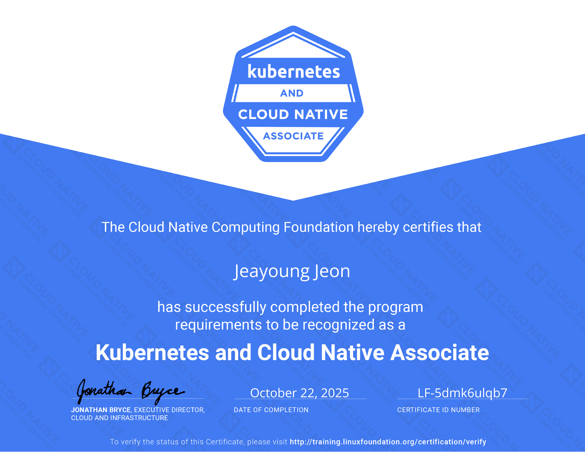

## 1. About the Certification

The Kubernetes and Cloud Native Associate (KCNA) certification validates foundational knowledge of Kubernetes and the broader cloud native ecosystem. Created by the Cloud Native Computing Foundation (CNCF) in collaboration with The Linux Foundation, KCNA is designed for individuals who want to demonstrate their understanding of cloud native technologies and Kubernetes fundamentals.

<!-- truncate -->

The KCNA exam is a proctored, online test that consists of 60 four-choice multiple-choice questions to be completed within 90 minutes. All questions are theoretical and there are no hands-on tasks. A passing score of 75% is required, and the certification is valid for 2 years. The exam covers:

- **Kubernetes Fundamentals**: 46% - Core concepts, architecture, and basic operations
- **Container Orchestration**: 22% - Container concepts, orchestration principles, and container runtimes
- **Cloud Native Architecture**: 16% - Cloud native principles, patterns, and design
- **Cloud Native Observability**: 8% - Monitoring, logging, and observability tools
- **Cloud Native Application Delivery**: 8% - CI/CD, GitOps, and deployment strategies

Unlike hands-on certifications like CKA or CKAD, KCNA focuses on theoretical knowledge and understanding of cloud native concepts, making it an excellent entry point for those new to the cloud native ecosystem.

## 2. My Experience

*My KCNA certification 2025. Issued on October 22, 2025. Expires on October 22, 2028. You can verify my certification [here](https://www.credly.com/badges/759e92f0-7b3b-4788-8eff-c20ad1e2c645).*

I took the KCNA exam on October 22, 2025, and passed it successfully. Coming from hands-on experience with Kubernetes through my CKA and CKAD certifications, I found the KCNA exam to be a good way to validate and systematize my theoretical understanding of the cloud native ecosystem.

The exam format consists entirely of four-choice multiple-choice questions with no hands-on components:
- All 60 questions are theoretical multiple-choice questions (no command-line tasks)
- Focus on concepts and principles rather than practical implementation
- Covers broader cloud native topics beyond just Kubernetes

The questions tested knowledge across the entire cloud native landscape, including CNCF projects, cloud native architectures, observability tools, and application delivery practices. While my practical experience with Kubernetes was helpful, the exam required a broader understanding of the ecosystem.

To aid my preparation, I enrolled in the [Kubernetes and Cloud-Native Associate (KCNA)](https://learn.kodekloud.com/user/courses/kubernetes-and-cloud-native-associate-kcna) course on KodeKloud, taught by Mumshad Mannambeth. I bougth basic plan on KodeKloud to access this course (Pro plan is not necessary). This comprehensive 9 hour course covered all exam domains including cloud-native architecture, container orchestration, Kubernetes fundamentals, application delivery, and observability. While KodeKloud provides hands-on lab environments for practice, the actual KCNA exam consists entirely of four-choice multiple-choice questions with no hands-on components. The course's interactive quizzes and mock exams were particularly valuable for reinforcing concepts and preparing for the actual exam format. If you are familar with Kubernetes, It actually takes 1 week to complete this course. The structured learning path helped me systematically build knowledge across the entire cloud native ecosystem.

## 3. Tips for Exam Preparation

Based on my experience, here are some important tips for those preparing for the KCNA exam:

**Essential Resources Before the Exam:**
- **Official CNCF Curriculum**: Review the official KCNA curriculum to understand the exact exam domains and their weightings
- **CNCF Landscape**: Familiarize yourself with the [CNCF Landscape](https://landscape.cncf.io/) - understand the categorization of projects (Graduated, Incubating, Sandbox) and their purposes. The exam may include questions about recently added projects
- **Recent CNCF Additions**: Pay special attention to projects that joined the CNCF ecosystem in the 2-3 months before your exam date. These newer projects can appear on the exam, so staying current is crucial

**Study Strategy:**
- If you're already familiar with Kubernetes (e.g., from CKA/CKAD), the KodeKloud course can be completed in about 1 week
- Focus on understanding the "why" and "what" rather than just the "how" - KCNA tests conceptual knowledge through four-choice multiple-choice questions only
- Practice with mock exams to get comfortable with the multiple-choice format (remember: no hands-on tasks on the actual exam)
- Review CNCF project documentation to understand each project's role in the cloud native ecosystem

**Important Reminder:**
The KCNA exam covers the entire cloud native landscape, not just Kubernetes. Make sure to allocate study time for observability tools, CI/CD practices, GitOps, and cloud native architecture patterns beyond your Kubernetes knowledge.

## 4. Summary

The KCNA certification serves as an excellent foundation for understanding the cloud native ecosystem. For those with hands-on Kubernetes experience (like CKA/CKAD holders), it provides an opportunity to validate and expand theoretical knowledge. For beginners, it offers a structured learning path into cloud native technologies.

Key characteristics of KCNA:
- **Entry-level certification**: Accessible to those new to cloud native technologies
- **Broad coverage**: Covers the entire cloud native ecosystem, not just Kubernetes
- **Theoretical focus**: Tests understanding of concepts and principles
- **Complementary**: Pairs well with hands-on certifications like CKA or CKAD

The KCNA certification validates a solid foundation in cloud native technologies and serves as a stepping stone for more advanced certifications or as a way to systematize existing knowledge.

I shared my certification on LinkedIn with [this post](https://www.linkedin.com/posts/jyje_the-linux-foundation-%EC%9E%90%EA%B2%A9%EC%88%98%EB%A3%8C%EC%A6%9Dkcna-kubernetes-activity-7388695644942684160-Nw_Y).
