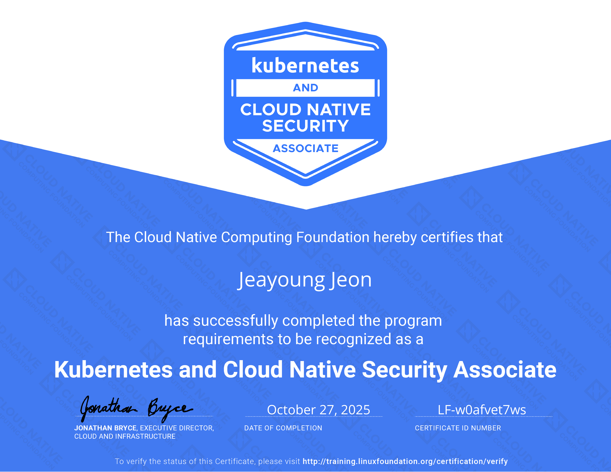

## 1. About the Certification

The Kubernetes and Cloud Native Security Associate (KCSA) certification validates foundational knowledge of security practices and principles for Kubernetes and the broader cloud native ecosystem. Created by the Cloud Native Computing Foundation (CNCF) in collaboration with The Linux Foundation, KCSA is designed for individuals who want to demonstrate their understanding of cloud native security concepts and best practices.

<!-- truncate -->

The KCSA exam is a proctored, online test that consists of 60 four-choice multiple-choice questions to be completed within 90 minutes. All questions are theoretical and there are no hands-on tasks. A passing score of 75% is required, and the certification is valid for 2 years. The exam covers security aspects across the cloud native landscape, including:

- **Kubernetes Security Fundamentals**: Core security concepts, pod security, network policies, and RBAC
- **Container Security**: Container image security, scanning, and runtime security
- **Cloud Native Security Tools**: Security tools and practices in the CNCF ecosystem
- **Security Best Practices**: Secure configuration, secrets management, and compliance
- **Threat Detection and Response**: Monitoring, logging, and incident response in cloud native environments

Unlike hands-on security certifications like CKS (Certified Kubernetes Security Specialist), KCSA focuses on theoretical knowledge and understanding of security concepts, making it an excellent entry point for those new to cloud native security.

## 2. My Experience

*My KCSA certification 2025. Issued on October 27, 2025. Expires on October 27, 2027. You can verify my certification [here](https://www.credly.com/badges/1206ad1c-e348-4328-934d-72e44ca434be).*

I took the KCSA exam on October 27, 2025, and passed it successfully. Coming from hands-on experience with Kubernetes security through my CKA and CKAD certifications, I found the KCSA exam to be an excellent way to validate and systematize my theoretical understanding of cloud native security practices.

The exam format consists entirely of four-choice multiple-choice questions with no hands-on components:
- All 60 questions are theoretical multiple-choice questions (no command-line tasks)
- Focus on security concepts, principles, and best practices rather than practical implementation
- Covers security aspects across the entire cloud native ecosystem, not just Kubernetes

The questions tested knowledge across various security domains, including Kubernetes security policies, container security, secrets management, network security, compliance, and security tools in the CNCF ecosystem. While my practical experience with Kubernetes was helpful, the exam required a comprehensive understanding of security principles and how they apply to cloud native environments.

To aid my preparation, I enrolled in the [Kubernetes and Cloud Native Security Associate (KCSA)](https://learn.kodekloud.com/user/courses/kubernetes-and-cloud-native-security-associate-kcsa) course on KodeKloud, taught by Mumshad Mannambeth and Nimesha Jinarajadasa. I bought basic plan on KodeKloud to access this course (Pro plan is not necessary). This comprehensive 6.78 hour course covered all exam domains including cloud native security overview, Kubernetes cluster component security, security fundamentals, threat models, platform security, and compliance frameworks. The course's hands-on labs, interactive content, and regular updates with the latest security information were particularly valuable. While KodeKloud provides hands-on lab environments for practice, the actual KCSA exam consists entirely of four-choice multiple-choice questions with no hands-on components. The course's interactive quizzes and mock exams helped reinforce security concepts and prepare for the actual exam format. The structured learning path and continuous content updates made it possible to pass the exam smoothly.

## 3. Tips for Exam Preparation

Based on my experience, here are some important tips for those preparing for the KCSA exam:

**Essential Resources Before the Exam:**
- **Official CNCF Curriculum**: Review the official KCSA curriculum to understand the exact exam domains and their weightings
- **CNCF Security Landscape**: Familiarize yourself with security-related projects in the [CNCF Landscape](https://landscape.cncf.io/) - understand security tools, their purposes, and how they fit into the cloud native security ecosystem. The landscape provides a comprehensive view of security projects categorized by their maturity levels (Graduated, Incubating, Sandbox)
- **CNCF Blog**: Regularly review the [CNCF Blog](https://www.cncf.io/blog/) for the latest security updates, best practices, and announcements about new security projects. The blog often covers security-related topics that may appear on the exam
- **Recent CNCF Security Additions**: Pay special attention to security projects that joined the CNCF ecosystem in the 2-3 months before your exam date. These newer security tools can appear on the exam, so staying current is crucial
- **Kubernetes Security Documentation**: Review official Kubernetes security documentation, especially on pod security, network policies, RBAC, and secrets management

**Study Strategy:**
- If you're already familiar with Kubernetes security (e.g., from CKS or security-focused work), the preparation can be completed more efficiently
- Focus on understanding security "why" and "what" rather than just the "how" - KCSA tests conceptual security knowledge through four-choice multiple-choice questions only
- Practice with mock exams to get comfortable with the multiple-choice format (remember: no hands-on tasks on the actual exam)
- Review security best practices and common vulnerabilities in cloud native environments
- Study CNCF security projects and their roles in the security ecosystem

**Important Reminder:**
The KCSA exam covers security aspects across the entire cloud native landscape, not just Kubernetes. Make sure to allocate study time for container security, secrets management, compliance, threat detection, and security tools beyond your Kubernetes knowledge.

## 4. Summary

The KCSA certification serves as an excellent foundation for understanding cloud native security. For those with hands-on Kubernetes experience (like CKA/CKAD/CKS holders), it provides an opportunity to validate and expand theoretical security knowledge. For beginners, it offers a structured learning path into cloud native security practices.

Key characteristics of KCSA:
- **Entry-level security certification**: Accessible to those new to cloud native security
- **Broad security coverage**: Covers security aspects across the entire cloud native ecosystem, not just Kubernetes
- **Theoretical focus**: Tests understanding of security concepts and principles
- **Complementary**: Pairs well with hands-on certifications like CKS or practical security experience

The KCSA certification validates a solid foundation in cloud native security technologies and serves as a stepping stone for more advanced security certifications or as a way to systematize existing security knowledge in the cloud native context.
