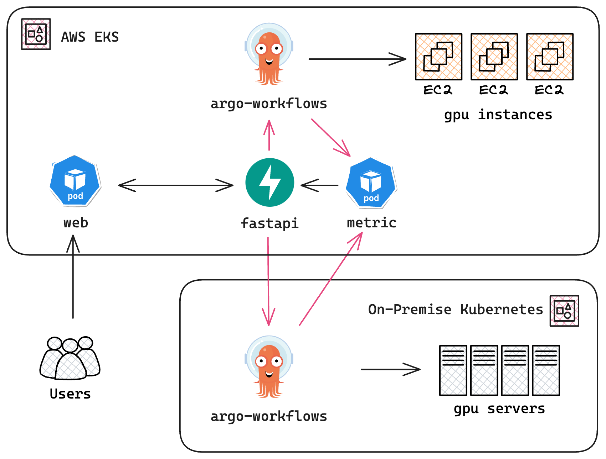

## 1. 개요

저희 팀은 온프레미스와 퍼블릭 클라우드 자원을 결합한 하이브리드 Kubernetes 클러스터를 구축했습니다. 이 아키텍처를 통해 온프레미스 자원의 한계를 극복하고 퍼블릭 클라우드 사용 비용을 최적화할 수 있었습니다.

<!-- truncate -->

저희 애플리케이션은 웹 애플리케이션과 머신러닝(ML) 파이프라인, 두 가지로 구성되어 있습니다. 웹 애플리케이션은 퍼블릭 클라우드에서 운영하고, ML 워크로드는 온프레미스 GPU 서버에서 실행합니다. 이 하이브리드 클러스터 아키텍처는 다음과 같은 이점을 제공합니다:

- **신뢰성**: 웹 애플리케이션과 데이터베이스를 퍼블릭 클라우드에 호스팅함으로써 24/7 고가용성과 안정성을 확보했습니다.
- **비용 최적화**: ML 워크로드를 온프레미스 GPU 서버에서 처리함으로써 퍼블릭 클라우드 비용을 50% 이상 절감했습니다.
- **확장성**: 온프레미스 클러스터의 자원이 부족해질 경우 퍼블릭 클라우드로 손쉽게 스케일 아웃할 수 있습니다. 온프레미스 클러스터에 장애가 발생하더라도 퍼블릭 클라우드가 백업 노드를 제공하여 ML 워크로드의 고가용성을 보장합니다.

다음 다이어그램은 하이브리드 클러스터의 아키텍처를 나타냅니다:

**DevOps를 위한 하이브리드 클러스터 아키텍처 다이어그램;** 사용자는 [AWS EKS](https://aws.amazon.com/eks) 기반 퍼블릭 클라우드에 호스팅된 웹 애플리케이션과 상호작용하며, ML 파이프라인은 온프레미스 클러스터에서 실행됩니다. 워크플로우 컨트롤러로는 [Argo Workflows]를 사용합니다. 메트릭 수집기는 온프레미스 클러스터의 가동 상태와 가용성을 모니터링하며, 필요 시 퍼블릭 클라우드의 백업 파이프라인을 자동으로 스케일 아웃합니다. 메트릭 서버는 [FastAPI]로 구현되었습니다.

## 2. 문제 정의

처음에는 웹 애플리케이션과 ML 파이프라인을 모두 AWS EKS 퍼블릭 클러스터에 배포했습니다. 그러나 AWS EC2의 GPU 인스턴스(예: g4dn)는 비용이 매우 높아, 월 수천 달러에 달하는 비용이 발생하면서 ML 워크로드를 퍼블릭 클라우드에서 운영하는 것은 비용 효율이 낮았습니다.

이 비용 문제를 해결하기 위해, ML 파이프라인을 GPU 서버가 갖춰진 온프레미스 클러스터로 전환했습니다. 퍼블릭 클라우드와 온프레미스 클러스터 간 통신을 위해 온프레미스 클러스터의 엔드포인트를 외부에 노출해야 했습니다.

퍼블릭 클라우드의 메트릭 수집기는 온프레미스 클러스터의 가동 상태와 가용성을 모니터링하도록 구성했습니다. 온프레미스 클러스터에 장애가 발생하거나 응답이 지연될 경우, 메트릭 수집기가 자동으로 퍼블릭 클라우드 자원을 스케일 아웃하여 ML 파이프라인의 고가용성을 유지합니다.

## 3. 구현 방법

위에서 설명한 아키텍처를 구현하기 위해 다음 단계를 진행했습니다:

### 3.1. 퍼블릭 클러스터: AWS EKS

웹 애플리케이션과 데이터베이스를 호스팅하기 위해 AWS EKS 퍼블릭 클러스터를 배포했습니다. EKS 클러스터에는 다음 컴포넌트를 배포했습니다:

- **웹 애플리케이션**: 사용자를 위한 프론트엔드 및 CMS 역할을 하는 웹 애플리케이션
- **데이터베이스**: 사용자 데이터와 애플리케이션 로그를 저장하는 PostgreSQL 및 MySQL 데이터베이스
- **메트릭 수집기**: 온프레미스 및 퍼블릭 클러스터의 가동 상태와 파이프라인 가용성을 모니터링하는 메트릭 수집기
- **백업 ML 파이프라인**: 온프레미스 클러스터를 사용할 수 없을 때 자동으로 스케일 아웃되는 백업 파이프라인

### 3.2. 온프레미스 클러스터: Bare-Metal Kubernetes

GPU 서버가 탑재된 온프레미스 Bare-Metal Kubernetes 클러스터를 배포했습니다. 온프레미스 클러스터에는 다음 컴포넌트를 배포했습니다:

- **ML 파이프라인**: 데이터를 처리하고 모델을 학습하는 머신러닝 파이프라인. GPU 서버에서 실행하여 학습 속도를 가속화합니다. 파이프라인 컨트롤러로 [Argo Workflows]를 사용했습니다.
- **메트릭 서버**: 온프레미스 클러스터의 가동 상태와 가용성을 퍼블릭 클라우드에 노출하는 서버. [FastAPI]와 [Prometheus SDK]를 활용해 구현했습니다.

### 3.3. ML 파이프라인 스케줄링

온프레미스 클러스터에 장애가 발생하거나 응답이 지연될 경우, 퍼블릭 클라우드의 메트릭 수집기가 자동으로 백업 ML 파이프라인을 스케일 아웃하여 ML 워크로드의 고가용성을 보장합니다. 온프레미스 클러스터가 복구되면 백업 파이프라인을 다시 스케일 인합니다.

## 4. 결론

이 프로젝트는 온프레미스와 퍼블릭 클라우드 자원을 느슨하게 결합한 하이브리드 클러스터의 구축 사례입니다. 이 아키텍처는 고가용성, 비용 최적화, 확장성을 동시에 제공합니다.

ML 워크로드를 온프레미스 GPU 서버에서 처리함으로써 퍼블릭 클라우드 비용을 50% 이상 절감했습니다. 퍼블릭 클라우드는 웹 애플리케이션과 데이터베이스의 고가용성 및 안정성을 보장합니다.

메트릭 수집기는 온프레미스 클러스터를 사용할 수 없을 때 알림을 발송하고, 백업 파이프라인을 자동으로 스케일 아웃하여 ML 워크로드의 고가용성을 유지합니다. 덕분에 온프레미스 클러스터의 가용 상태에 따라 퍼블릭 클라우드 자원 규모를 유연하게 조정할 수 있습니다.

## 5. 향후 계획

최근에는 AWS EKS Anywhere를 활용하여 온프레미스와 퍼블릭 노드를 단일 EKS 클러스터로 통합하는 사례가 늘고 있습니다. 온프레미스 클러스터를 EKS Anywhere로 마이그레이션하는 개념 검증(PoC)을 진행하여 하이브리드 클러스터 관리를 단순화할 계획입니다.

## 6. 사용 기술

이 프로젝트에서 활용한 주요 기술:

- [AWS EKS]
- [Kubernetes]
- [Kubespray]
- [Argo Workflows]
- [FastAPI]
- [Prometheus SDK]

[AWS EKS]: https://aws.amazon.com/eks "Amazon Elastic Kubernetes Service"
[Kubernetes]: https://kubernetes.io "Kubernetes: Production-Grade Container Orchestration"
[Kubespray]: https://kubespray.io "Kubespray: Kubernetes Cluster Deployment Tool"
[Argo Workflows]: https://argoproj.github.io/workflows "Workflow Engine in Argo Projects"
[FastAPI]: https://fastapi.tiangolo.com "FastAPI: Python API Framework"
[Prometheus SDK]: https://github.com/prometheus/client_python "Python Package for Prometheus Client"
