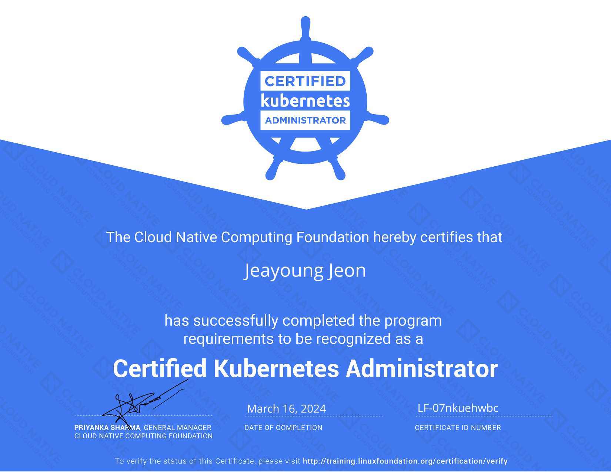
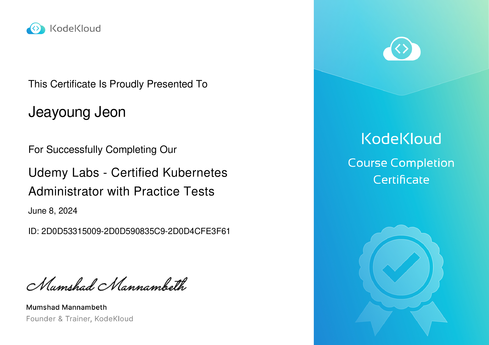

## 1. 자격증 소개

Certified Kubernetes Administrator (CKA) 프로그램은 Kubernetes 생태계 발전을 위해 CNCF(Cloud Native Computing Foundation)와 The Linux Foundation이 공동으로 만들었습니다. 가장 빠르게 성장하는 오픈소스 프로젝트 중 하나인 Kubernetes의 사용이 폭발적으로 늘어나고 있습니다. CKA 프로그램을 통해 핸즈온 커맨드라인 환경에서 실제 역량을 입증할 수 있습니다.

<!-- truncate -->

CKA 시험은 Kubernetes가 실행 중인 커맨드라인에서 여러 문제를 직접 해결해야 하는 핸즈온 방식의 감독 시험입니다. 시험은 실제 업무 환경에서 Kubernetes 관리자로서 필요한 역량에 초점을 맞춥니다.

## 2. 시험 후기

*CKA 자격증 2024. 2024년 3월 16일 발급. 2027년 3월 15일 만료. 자격증 확인은 [여기](https://www.credly.com/badges/d944bde7-222a-4ce5-b4e6-4e6c84df0ef8)에서 할 수 있습니다.*

<!-- Overview -->
2024년 3월 15일에 CKA 시험을 보고 첫 시도에 합격했습니다. 쉽지 않은 시험이었지만 준비한 덕분에 통과할 수 있었습니다. Kubernetes 공식 문서를 꼼꼼히 읽고, 온라인 강좌를 수강하면서 Kubernetes 클러스터를 직접 다루며 준비했습니다.

시험 준비를 위해 Udemy의 [Certified Kubernetes Administrator (CKA) with Practice Tests](https://www.udemy.com/course/certified-kubernetes-administrator-with-practice-tests) 강좌를 수강하며 Kubernetes 핵심 개념을 이해했습니다. 또한 [KodeKloud](https://learn.kodekloud.com/user/courses/udemy-labs-certified-kubernetes-administrator-with-practice-tests) 플랫폼을 통해 Kubernetes 클러스터 실습과 핸즈온 랩을 진행했습니다. 아래는 KodeKloud 강좌 수료증입니다:

이 강좌 수료증은 [여기](https://kodekloud.com/certificate-verification/2D0D53315009-2D0D590835C9-2D0D4CFE3F61)에서 확인할 수 있습니다.

## 3. Share to the World

  <iframe src="https://www.linkedin.com/embed/feed/update/urn:li:share:7175108596026781696" height="700px" width="90%" frameborder="0" allowfullscreen="" title="Excited to share that I've successfully completed the Certified Kubernetes Administrator (CKA) program from The Linux Foundation"></iframe>

