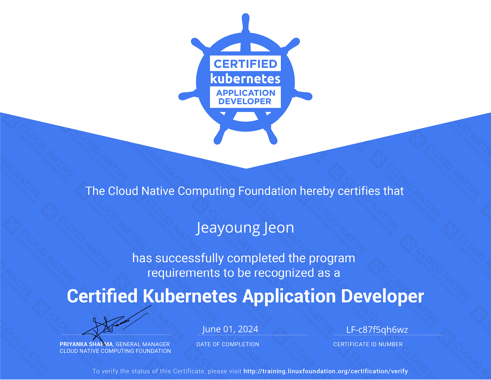

## 1. 자격증 소개

Certified Kubernetes Application Developer (CKAD) 프로그램은 Kubernetes 생태계 발전을 위해 CNCF(Cloud Native Computing Foundation)와 The Linux Foundation이 공동으로 만들었습니다. CKAD 프로그램을 통해 Kubernetes용 클라우드 네이티브 애플리케이션을 설계, 구축, 배포하는 역량을 입증할 수 있습니다. 일반적으로 개발자는 Kubernetes에서 워크로드를 구성하고 운영하는 역할을 담당합니다.

<!-- truncate -->

CKA 시험과 마찬가지로, CKAD 시험도 Kubernetes가 실행 중인 커맨드라인에서 여러 문제를 직접 해결해야 하는 핸즈온 방식의 감독 시험입니다. 시험은 실제 업무 환경에서 Kubernetes 애플리케이션 개발자로서 필요한 역량에 초점을 맞춥니다.

## 2. 시험 후기

*CKAD 자격증 2024. 2024년 6월 1일 발급. 2026년 6월 1일 만료. 자격증 확인은 [여기](https://www.credly.com/badges/9e072a3a-57d0-403e-8bef-5831d618675c)에서 할 수 있습니다.*

2024년 5월 31일에 CKAD 시험을 보고 합격했습니다. 쉽지 않은 시험이었지만 합격 기준을 충족했습니다. Kubernetes 공식 문서를 꼼꼼히 읽고, 온라인 강좌를 수강하면서 KodeKloud에서 Kubernetes 클러스터를 직접 다루며 준비했습니다.

## 3. Share to the World

  <iframe src="https://www.linkedin.com/embed/feed/update/urn:li:share:7202975037543317506" height="700px" width="90%" frameborder="0" allowfullscreen="" title="Again, I'm thrilled to share that I've successfully completed the Certified Kubernetes Application Developer (CKAD) program from The Linux Foundation"></iframe>

