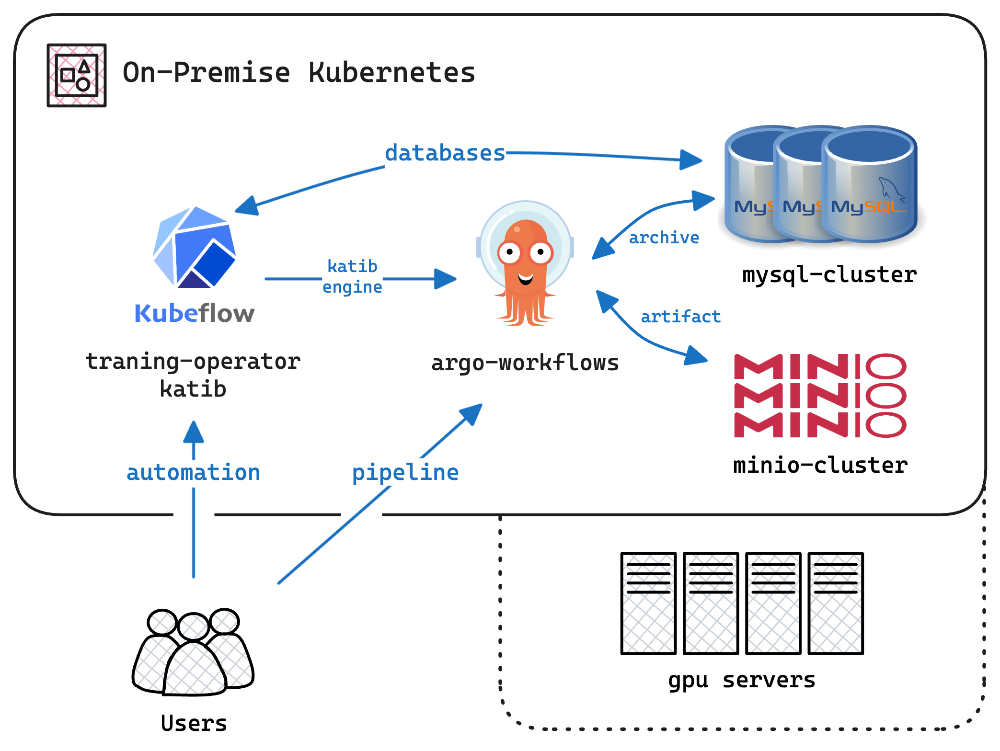

> Photo by <a href="https://unsplash.com/@nampoh?utm_content=creditCopyText&utm_medium=referral&utm_source=unsplash">Maxim Hopman</a> on <a href="https://unsplash.com/photos/a-group-of-people-standing-around-a-display-of-video-screens-IayKLkmz6g0?utm_content=creditCopyText&utm_medium=referral&utm_source=unsplash">Unsplash</a>

## 1. 개요

저희 팀은 Kubeflow, JupyterHub, 데이터 파이프라인 등 최신 오픈소스 프로젝트를 활용하여 온프레미스 MLOps 클러스터를 구축했습니다. 한정된 GPU 자원 환경에서 GPU 유휴 시간을 줄이고 ML 워크로드 운영 비용을 최적화하도록 설계된 아키텍처입니다. 또한 단일 학습 작업을 여러 GPU에 병렬 분산함으로써, 단일 GPU 서버의 한계를 넘어 클러스터 전체 GPU를 활용할 수 있습니다.

<!-- truncate -->

온프레미스 자원 기반의 MLOps 클러스터는 다음과 같은 이점을 제공합니다:

- **자원 활용**: 클러스터의 모든 GPU 자원을 효율적으로 활용하여 GPU 유휴 시간을 줄입니다. **GPU 24시간 가동**으로 기존 환경 대비 GPU 활용률을 3배 향상시켰습니다.
- **AutoML**: 자동화된 모델 선택 및 하이퍼파라미터 튜닝을 지원하는 AutoML 워크플로우를 제공합니다. 2주 동안 **800회 이상의 실험**을 수행했으며, 이 결과는 상용화에 활용되었습니다.
- **병렬 학습**: 단일 학습 작업을 여러 GPU에 병렬 분산하여 클러스터 전체 GPU를 활용할 수 있습니다.
- **원격 노트북**: 연구자들에게 온디맨드 Jupyter 노트북을 제공하여 ML 연구 자원을 분산합니다. 자원 제약 없이 클러스터에 접속하고 실험을 실행할 수 있습니다.

다음 다이어그램은 MLOps를 위한 온프레미스 클러스터 아키텍처를 나타냅니다:

**MLOps를 위한 온프레미스 Kubernetes 아키텍처 다이어그램;** 사용자는 [Kubeflow]를 통해 ML 워크플로우를 관리하고 자동화합니다. [Kubeflow/Katib]은 하이퍼파라미터 튜닝을 위해 Argo Workflows를 워크플로우 엔진으로 활용하고, [Kubeflow/Training Operator]는 분산 학습 작업을 관리합니다. [Argo Workflows]가 이 ML 파이프라인들을 오케스트레이션합니다. MySQL 클러스터는 워크플로우 메타데이터와 결과를 저장하고, MinIO 클러스터는 아티팩트 스토리지를 담당합니다. 클러스터의 GPU 서버가 모델 학습에 필요한 연산 능력을 제공합니다.

## 2. 문제 정의

저희 조직의 AI 연구자들은 한정된 GPU 자원으로 인한 어려움을 겪고 있었습니다. 연구자마다 GPU 서버 한 대씩 배정받는 구조였기 때문에, 서버가 유휴 상태일 때는 GPU가 낭비되고 대규모 실험을 수행할 때는 자원이 부족한 문제가 있었습니다.

이러한 문제를 해결하기 위해, GPU 서버를 클러스터로 통합하고 오픈소스 프로젝트 기반의 MLOps 플랫폼을 도입하는 방안을 제안했습니다. 구체적인 목표는 다음과 같습니다:

- **자원 공유**: 연구자들이 클러스터의 GPU 자원을 공유하고 실험에 모든 가용 GPU를 활용할 수 있도록 합니다.
- **편리한 개발 환경**: 연구자들이 ML 실험을 쉽게 개발하고 실행할 수 있는 환경을 제공합니다.
- **AutoML 지원**: 모델 선택, 하이퍼파라미터 튜닝, 모델 평가를 자동화하는 AutoML 워크플로우를 구현합니다.
- **병렬 학습**: 클러스터의 여러 GPU를 활용한 병렬 학습을 지원합니다.
- **원격 노트북**: ML 연구 자원 분산을 위한 온디맨드 Jupyter 노트북을 제공합니다.

프로젝트는 MLOps 플랫폼의 효과와 AI 연구에 미치는 영향을 검증하기 위한 개념 검증(PoC)부터 시작했습니다.

## 3. 구현 방법

위에서 설명한 아키텍처를 구현하기 위해 다음 단계를 진행했습니다:

### 3.1. 온프레미스 클러스터 구성

기존에 GPU 서버가 갖춰진 온프레미스 클러스터가 있었습니다. GPU 서버를 클러스터에 통합하고 MLOps 워크플로우를 지원하도록 구성했습니다. 클러스터에 배포한 핵심 컴포넌트는 다음과 같습니다:

- **Argo Workflows**:
  Kubernetes에서 ML 파이프라인을 실행하는 범용 워크플로우 컨트롤러입니다. Argo Workflows를 통해 연구자들에게 별도의 인프라 설정 없이도 유연하고 확장 가능한 워크플로우 시스템을 제공할 수 있었습니다.
- **GPU Operator**:
  클러스터의 GPU 자원을 관리하고 연구자들이 모든 가용 GPU를 실험에 활용할 수 있도록 지원하는 오퍼레이터입니다.
- **Kubeflow**:
  ML 모델의 실행, 학습, 배포를 위한 Kubernetes 기반 머신러닝 툴킷입니다. 학습 작업 및 실험 관리에 활용했습니다.

라이선스 비용 없이 자유롭게 커스터마이징할 수 있는 환경을 구축하기 위해 이 오픈소스 프로젝트들을 선택했습니다.

### 3.2. Argo Workflows로 데이터 파이프라인 구현

- **이번에는 Kubeflow가 아닙니다**:
  Kubeflow는 ML 모델의 실행, 학습, 배포를 위한 Kubernetes 기반 머신러닝 툴킷입니다. 학습 작업 및 실험 관리에는 Kubeflow를 사용했지만, 데이터 파이프라인 관리에는 Argo Workflows를 선택했습니다. 데이터 파이프라인에서의 Kubeflow에 대한 특이사항은 다음과 같습니다:

  - **즉시 정적 그래프 제공**:
    Kubeflow Pipeline은 파이프라인의 정적 그래프를 내장 시각화로 보여줍니다. 파이프라인 구조를 시각적으로 파악하기 쉽다는 장점이 있습니다.

  - **사전 빌드 필요**:
    Kubeflow는 파이프라인을 사전에 빌드해야 하므로 시간이 걸리고 유연성이 떨어집니다. Kubeflow Pipeline의 작업에는 학습 및 추론을 위한 이미지가 미리 빌드되어 있어야 해서, 파이프라인을 빠르게 수정하기 어렵습니다. CI/CD 파이프라인으로 보완할 수 있지만 여전히 추가 작업이 필요합니다. 이 점이 Argo Workflows를 선택하게 된 핵심 이유였습니다.

- **다시, Argo Workflows**:
  Argo Workflows는 클라우드 네이티브 환경을 위한 범용 워크플로우 컨트롤러입니다. GPU Operator와 함께 사용하면 다양한 그래프 구조의 데이터 파이프라인을 구성할 수 있습니다. 일반적으로 Argo Workflows는 YAML로 정의하지만, 저희는 Python 스크립트로 워크플로우를 정의할 수 있는 Argo Workflows SDK인 Hera를 사용했습니다. 이 방식 덕분에 ML 연구자들이 워크플로우를 더 쉽게 작성하고 수정할 수 있었습니다. 데이터 파이프라인에서의 Argo Workflows 특이사항은 다음과 같습니다:

  - **사전 빌드 불필요**:
    Argo Workflows는 데이터 파이프라인에 별도의 이미지 사전 빌드가 필요 없습니다. 연구자들은 Python 스크립트로 파이프라인을 정의하고 바로 실행할 수 있습니다. 덕분에 파이프라인을 손쉽게 수정하고 빠르게 실험을 돌릴 수 있습니다.

    학습 단계에서는 사전 빌드된 이미지에 스크립트를 추가하는 방식이나, Hera SDK로 환경을 구성하는 CUDA scratch 이미지를 사용하는 방식 모두 선택할 수 있습니다.
    추론 단계도 마찬가지입니다.

  - **내장 그래프 없음 — 모든 것을 직접 구성**:
    Argo Workflows는 파이프라인 그래프를 기본으로 제공하지 않습니다. 연구자가 Python 스크립트에서 직접 그래프 구조를 정의해야 합니다. 이 유연성 덕분에 특정 요구에 맞는 커스텀 파이프라인을 만들 수 있지만, 장단점이 될 수 있습니다. 시각화가 필요하다면 Grafana나 TensorBoard 같은 도구를 별도로 활용할 수 있습니다.

  클러스터에 Argo Workflows가 있다면, Argo Workflows와 Hera SDK만으로 데이터 파이프라인 시스템을 바로 구성할 수 있습니다.

### 3.3. Kubeflow에서 Katib AutoML 구성

Katib AutoML은 ML 모델의 하이퍼파라미터 튜닝과 병렬 좌표 그래프 시각화를 제공합니다. Katib를 활용하여 하이퍼파라미터 최적화와 최적 모델 선택 과정을 자동화했습니다. Katib는 Argo Workflows 같은 외부 엔진을 지원하므로, Katib와 Argo Workflows를 연동하여 AutoML 프로세스를 관리했습니다.

Katib의 핵심 기능은 지속적인 하이퍼파라미터 튜닝입니다. 연구자들은 탐색할 하이퍼파라미터 공간과 최적화 목표 지표를 정의하면, Katib가 여러 실험을 병렬로 실행하며 목표 지표를 기준으로 하이퍼파라미터를 조정합니다. 실험 진행 상황을 모니터링하고 결과를 바탕으로 최적 모델을 선택할 수 있으며, GPU 자원을 24시간 AutoML 실험에 활용할 수 있습니다. 2주 동안 **800회 이상의 실험**을 수행했고, 이 결과는 상용화에 활용되었습니다.

### 3.4. Kubeflow에서 Training Operator 구성

분산 학습 환경 관리를 위해 Kubeflow Training Operator를 선택했습니다. Training Operator는 학습 작업에 대한 고수준 추상화를 제공하여, 연구자들이 클러스터의 모든 가용 GPU를 병렬 학습에 활용할 수 있도록 합니다. 다만 저희가 사용한 v1.6 버전에서는 Argo Workflows 같은 외부 엔진을 지원하지 않아, Kubeflow Training Operator 자체만으로 분산 학습 환경을 관리했습니다.

Training Operator를 통해 GPU 수, 메모리, CPU 코어 수 등 커스텀 자원으로 학습 작업을 정의할 수 있습니다. **2대의 GPU 서버에서 GPU 8개를 사용하는 학습 작업**을 구성하여 GPU 전체에 병렬 분산했습니다. 덕분에 연구자들은 추가 인프라 설정 없이 학습 속도를 높이고 클러스터의 모든 GPU 자원을 최대한 활용할 수 있었습니다.

### 3.5. 연구자를 위한 JupyterHub 배포

처음에는 JupyterLab을 검토했지만, 클러스터 자원 현황을 확인할 수 있는 JupyterHub를 최종 선택했습니다. JupyterHub는 현재 클러스터 상태와 가용 자원을 연구자들에게 직관적으로 보여줍니다.

TensorFlow, PyTorch, scikit-learn 등 ML 연구에 필요한 라이브러리와 도구가 포함된 사전 빌드 노트북 이미지를 제공했습니다. 연구자들은 프로비저닝된 NFS 스토리지의 데이터 레이크에 쉽게 접근하고, 자원 제약 없이 실험을 실행할 수 있었습니다.

## 4. 결론

이 프로젝트에서 Kubeflow, Argo Workflows, JupyterHub 등 최신 오픈소스 프로젝트를 활용하여 온프레미스 MLOps 클러스터를 구축했습니다. 연구자들에게 ML 실험을 개발하고 실행할 수 있는 유연하고 확장 가능한 환경을 제공합니다. 한정된 GPU 자원 환경에서도 클러스터의 모든 GPU를 효율적으로 활용하여 GPU 유휴 시간을 줄이고 ML 워크로드 운영 비용을 최적화했습니다.

## 5. 향후 계획

앞으로는 사용자 경험 개선을 계획하고 있습니다. ML 연구자들이 요청한 편의 기능 두 가지는 다음과 같습니다:

- **모니터링**:
  연구자들이 실험 진행 상황을 모니터링하고 결과를 실시간으로 시각화하고 싶다는 요청이 있었습니다. Grafana를 연동하여 연구자용 모니터링 대시보드를 제공할 계획입니다.
- **노트북 SSH 접속**:
  연구자들이 Jupyter 노트북에 SSH로 접속하고 싶다는 요청도 있었습니다. SSH 접속을 지원하는 JupyterHub 커스텀 스포너를 구현하거나, 챗봇이 노트북 스택을 직접 생성하는 방식을 도입할 예정입니다.

## 6. 사용 기술

이 프로젝트에서 활용한 주요 기술:

- [Argo Workflows]
- [Kubeflow]
- [Kubeflow/Katib]
- [Kubeflow/Training Operator]
- [JupyterHub]
- [Grafana]

[Argo Workflows]: https://argoproj.github.io/workflows "Workflow Engine in Argo Projects"
[Kubeflow]: https://www.kubeflow.org "Kubeflow: Machine Learning Toolkit for Kubernetes"
[Kubeflow/Katib]: https://www.kubeflow.org/docs/components/katib/overview "Kubeflow Katib: Hyperparameter Tuning"
[Kubeflow/Training Operator]: https://www.kubeflow.org/docs/components/training/overview "Kubeflow Training Operator: Distributed Training"
[JupyterHub]: https://jupyter.org/hub "JupyterHub: Multi-user Jupyter Notebook Server"
[Grafana]: https://grafana.com/grafana "Grafana: The Observability Platform for Metrics and Logs"
