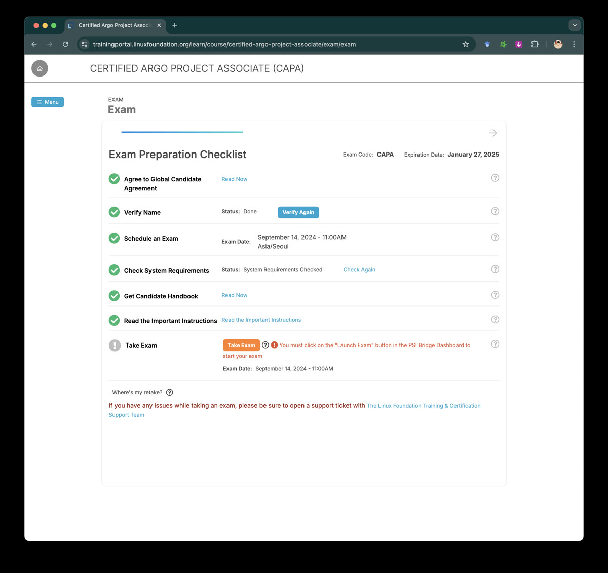

지난 주말에 합격한 [CAPA (Certified Argo Project Associate)](https://training.linuxfoundation.org/certification/certified-argo-project-associate-capa/) 자격증 취득 후기를 공유드립니다. CAPA는 2024년 상반기에 신설된 따끈따끈한 자격증으로, [Argo 프로젝트](https://argoproj.github.io/)를 다루는 역량을 검증하는 Associate 수준의 시험입니다. 이 글은 Argo 프로젝트와 CAPA 자격증에 대한 간단한 소개, 그리고 제 취득 과정에 대한 기록입니다. CAPA에 도전하시거나 관심이 있는 분들에게 도움이 되기를 바랍니다 🚀

<!-- truncate -->

## 1. 자격증 소개

### Argo 프로젝트란?

<figure class="figure" style="float: right; width: 330px; max-width: 68%; margin: 0.25rem 1.0rem">
  
  <figcaption class="figcaption" style="margin-top: 0.5rem; font-size: 0.75em; color: var(--gray);">공식 마스코트는 아니에요 — 문어(혹은 쭈꾸미)를 닮은 인형 사진이에요. Photo by <a href="https://unsplash.com/@cosiela?utm_content=creditCopyText&utm_medium=referral&utm_source=unsplash">Cosiela Borta</a> on <a href="https://unsplash.com/photos/a-pink-octopus-stuffed-animal-sitting-on-top-of-a-table-S3VKHlvBfMA?utm_content=creditCopyText&utm_medium=referral&utm_source=unsplash">Unsplash</a></figcaption>
</figure>

[Argo 프로젝트](https://argoproj.github.io/)는 쿠버네티스 클러스터와 결합해 클러스터를 하나의 DevOps 플랫폼처럼 동작하게 만드는 도구 모음으로, 쿠버네티스 활용 사례가 늘어나면서 점점 더 주목받고 있습니다. 4개의 구성 요소로 이루어져 있습니다:

- **Argo Workflows**: ML 파이프라인, CI/CD 파이프라인 등 범용 워크플로우를 위한 오케스트레이션 엔진
- **Argo CD**: 선언형 지속적 배포 도구 (4개 도구 중 가장 유명합니다)
- **Argo Rollouts**: 다양한 배포 전략을 지원하는 업데이트 관리 도구
- **Argo Events**: 코드 변경 등 다양한 이벤트를 감지하는 이벤트 기반 자동화 도구

겉보기에는 CI/CD 도구 모음 같지만, 실제로는 쿠버네티스와 결합해 범용으로 쓸 수 있도록 설계되었습니다. Argo Workflows로 CI 대신 데이터·ML 파이프라인을 구성할 수 있고, Argo CD로 웹서버 대신 쿠버네티스 리소스를(심지어 Argo CD 스스로도) 배포할 수 있습니다.

### CAPA 자격증이란?

[CAPA (Certified Argo Project Associate)](https://training.linuxfoundation.org/certification/certified-argo-project-associate-capa/)는 Argo 프로젝트의 4가지 앱(Workflows, CD, Events, Rollouts)에 대한 이해와 사용법을 검증하는 시험입니다. 특징은 다음과 같습니다:

- CNCF와 Linux Foundation이 시행하는 국제 기술 자격증입니다.
- 입문-중급 난도의 Associate 시험으로, 아직 더 높은 난도의 자격증은 없습니다.
- 감독관과 소통하며 응시하는 라이브 시험으로, [PSI 시큐어 브라우저](https://test-takers.psiexams.com/) 환경에서 진행됩니다.
- 90분 동안 60문항(4지선다 객관식)을 풀어야 하며, 75/100점을 얻으면 합격입니다. 최대 2회 응시할 수 있습니다.
- 합격 시점부터 2년간 유효하며, 제출 후 약 10분 안에 합격 여부를 알 수 있습니다.

CKA, CKAD, CKS 같은 쿠버네티스 자격증에 응시해보신 분들에게는 익숙한 시험 환경입니다.

## 2. 시험 후기

*CAPA 자격증 2024. 2024년 9월 14일 발급, 2026년 9월 15일 만료. 자격증 확인은 [여기](https://www.credly.com/badges/ee42c2c7-2ac3-411f-8713-cc26cbec8022)에서 할 수 있습니다.*

### 왜 취득했나요?

**1. 2년간 회사 업무에서 Argo 프로젝트를 적극 사용해왔고, 이에 대한 중간 점검을 하고 싶었습니다.**

- 데이터 파이프라인과 CI/CD 파이프라인의 엔진으로 Argo Workflows를 사용했습니다.
- 웹 배포와 쿠버네티스 리소스 배포에 Argo CD를 사용했습니다.
- 여러 배포 전략을 코드로 관리하기 위해 Argo Rollouts를 도입했습니다.
- 커스텀 CI/CD를 위한 이벤트 소싱으로 Argo Events를 사용했습니다.

**2. Argo 프로젝트의 국내 도입 사례가 늘어나고 있어, 업계 트렌드를 잘 따라가고 싶었습니다.**

당근, 토스, 데브시스터즈, 사이오닉AI 등 IT 대기업과 유니콘 AI 기업에서 Argo 프로젝트를 사용하는 사례가 점차 늘고 있습니다. 트렌디한 기술을 제대로 소화하고, 사용 경험을 기록하는 것을 넘어 공인 자격증으로 예측 가능한 역량을 확보하고 싶었습니다.

### 도움이 됐나요?

많은 도움이 되었습니다. Argo Workflows와 Argo CD는 거의 매일 사용했지만, 막상 체계적으로 정리해본 적은 없었거든요. 이번 기회에 배운 내용을 정리하고, 부족했던 부분도 채울 수 있었습니다.

**자격증 취득 전**에는 4가지 Argo 앱의 기획 의도와 사용처에 대한 개념을 확실히 정리할 수 있었고, 상대적으로 덜 사용했던 Argo Rollouts와 Argo Events의 숨은 기능들을 알게 되었습니다. Argo Rollouts의 모든 배포 전략(canary, blue/green, delayed rolling, 커스텀 업데이트 등)과 Argo Events의 다양한 트리거(쿠버네티스 리소스 트리거, S3 트리거, 커스텀 웹훅 트리거 등)를 직접 테스트해봤습니다. 업무에 필요한 기능만 쓰고 있었는데, 많은 기여자들이 만들어 둔 기능을 비로소 제대로 활용할 수 있게 되었습니다.

**자격증 취득 후**에는 공식 문서를 더 꼼꼼히 보게 되었고, 자주 쓰던 Argo Workflows와 Argo CD에서도 몰랐던 기능을 발견하면서 리팩터링하고 싶은 부분이 많이 떠올랐습니다. 몇 가지 예를 들면:

- [Argo Workflows의 SSO 게스트 계정](https://argo-workflows.readthedocs.io/en/stable/argo-server-sso/)
  - "신규 입사자가 워크플로우를 모니터링은 하되 리소스를 삭제하지 못하게 할 수 있을까?" → SSO + RBAC으로 초기 권한을 최소화해서 관리할 수 있습니다. (이 부분은 CKA에서 다루는 스킬과도 맞닿아 있었습니다)
- [Argo CD의 싱크 윈도우(Sync Windows)](https://argo-cd.readthedocs.io/en/stable/user-guide/sync_windows/)
  - "정기 점검하는 목요일 새벽에는 오토싱크를 꺼둘 수 있을까?" → `syncWindows`에 목요일만 `deny`로 설정하면, 원하는 시간대에 동기화가 일어나지 않게 할 수 있습니다.
- [Argo CD의 ApplicationSet Git Generator](https://argo-cd.readthedocs.io/en/stable/operator-manual/applicationset/Generators-Git/)
  - "운영 중에 부수적으로 생기는 리소스도 함께 동기화하고 제어할 수 있을까?" → `ApplicationSet`을 이용하면 git 리포지토리의 하위 디렉토리와 쿠버네티스 파생 리소스를 동기화할 수 있습니다.

결국 모든 오픈소스 활용의 공통 역량은 **공식 문서를 잘 읽고 활용하는 것**이라는 사실을 다시 한번 깨달았습니다.

### 시험은 어떻게 준비했나요?

신생 시험이라 자료가 충분하지 않습니다. Argo Workflows와 Argo CD는 한국어 자료도 꽤 있지만, Argo Rollouts와 Argo Events는 거의 공식 문서에만 의존해야 했습니다.

사설 강의는 거의 없고, 공식 강의인 [DevOps and Workflow Management with Argo (LFS256)](https://training.linuxfoundation.org/training/devops-and-workflow-management-with-argo-lfs256/)가 있습니다. 이 강의를 정주행하면 시험 범위를 충분히 커버할 수 있을 거라 생각합니다. 저는 무슨 생각이었는지 강의 없이 시험만 구매했는데, 현업에서 사용 중이니 큰 공부 없이도 패스할 수 있을 거라 생각했나 봅니다. 그리고 꽤 고생했습니다. 여러분의 정신 건강을 위해 할인 기간에 강의도 함께 구매하시는 걸 추천드립니다.

저는 결국 [공식 문서](https://argo-cd.readthedocs.io/)와 GitHub 소스 코드로 독학했습니다. 시험 범위는 [CAPA Curriculum PDF](https://github.com/cncf/curriculum/blob/master/CAPA_Curriculum.pdf)에 정리되어 있는데, 어떤 게 시험에 나올지 가늠하기 어려워서 모든 항목을 공부했습니다. 1회차는 문서를 정독하는 겉핥기, 2회차는 나올 법한 부분을 직접 구현해보는 식으로 진행했습니다. Hands-on이 아닌 객관식 시험이라 오픈북도, 실행하며 검증하기도 어려우니 미리 실험해보는 게 좋습니다. 실험에는 docker-desktop, kind, microk8s, orbstack 같은 쿠버네티스 시뮬레이터를 사용했는데, macOS에서는 빠른 클러스터 초기화를 위해 orbstack을 가장 많이 썼습니다.

### 시험은 어떻게 진행되나요?

[시험 페이지](https://training.linuxfoundation.org/certification/certified-argo-project-associate-capa/)에서 시험을 구매(이벤트 쿠폰이 있다면 저렴하게 구매 가능)하고, [Training & Certification 대시보드](https://trainingportal.linuxfoundation.org/learn/dashboard)에서 원하는 날짜로 예약하면 됩니다. 시험 당일에는 같은 대시보드에서 아래와 같은 준비 체크리스트를 확인한 뒤 **Take Exam**을 누르면 시작됩니다.

*Linux Foundation Training & Certification 대시보드의 CAPA 시험 준비 체크리스트 화면.*

진행 방식에서 기억해둘 만한 점들:

- **4지선다 객관식**입니다. 오답인 티가 나는 보기가 의외로 많아 체감 난도는 낮은 편이지만, 정답과 헷갈리는 보기가 꼭 하나씩 있어 영문 설명을 꼼꼼히 읽어야 합니다.
  - 체감 난이도는 **CKAD와 비슷**했습니다. 관련 시험과 비교하면 대략 [KCNA](https://training.linuxfoundation.org/certification/kubernetes-cloud-native-associate/) < [CKAD](https://training.linuxfoundation.org/certification/certified-kubernetes-application-developer-ckad/) = CAPA < [CKA](https://training.linuxfoundation.org/certification/certified-kubernetes-administrator-cka/) < [CKS](https://training.linuxfoundation.org/certification/certified-kubernetes-security-specialist/) 순서 정도로 느껴졌습니다.
  - 75점은 4가지 Argo 앱의 주요 기능을 익숙하게 다룰 줄 알면 충분하지만, 100점을 노린다면 잘 안 쓰는 세부 기능의 이름과 사용법, 그리고 헷갈리는 오답까지 구분할 수 있어야 합니다.
- [PSI 시큐어 브라우저](https://test-takers.psiexams.com/) 환경에서 응시합니다. CKA·CKAD·CKS에 응시해보셨다면 익숙한 환경일 거예요. 다만 지원 OS는 꼭 미리 확인하세요 — 저는 macOS 개발자 베타를 쓰다가 시험 직전에 급히 롤백한 적이 있습니다.
- **오픈북이 아닙니다.** 공식 문서도 CLI도 사용할 수 없어서, 현장에서 찾아보거나 직접 검증하며 풀 수는 없습니다.
- 60문항을 다 푼 뒤에 다시 검토할 수 있고, `review` 토글로 헷갈리는 문항을 표시해둘 수 있습니다.
- 중간에 최대 15분 정도 휴식(화장실)을 요청할 수 있지만, 이때도 시험 시간은 계속 흐르는 것처럼 보였으니 가능하면 미리 다녀오는 게 좋습니다.

### 시험 내용은 어땠나요?

> 시험 약관에 따라 구체적인 문항은 언급하지 않습니다.

- Argo Workflows의 YAML을 보고 어떤 순서로 실행되는지 맞히는 문항이 몇 개 나옵니다. 보기 중에 "실행 불가능"이라는 선택지도 있으니 유심히 봐야 합니다.
- CLI뿐 아니라 GUI 관련 질문도 생각보다 많이 나옵니다. 최신 버전 Argo Workflows·Argo CD의 GUI도 한 번씩 살펴보고 가시는 걸 추천합니다.
- 원하는 기능이 YAML의 `spec.a.b`인지 `spec.b.a`인지 `spec.c`인지 구분하는 문항도 나옵니다.
- 전반적인 난도는 어렵지 않은 편이라, 현업에서 사용해보신 분들이라면 무난히 통과하실 수 있을 것 같습니다.

추가로 도움이 됐던 팁들:

- 애매한 문제는 일단 `review`로 표시하고 넘어가세요. 다른 문제의 보기에서 힌트(예: 올바른 YAML 문법)를 얻을 수 있는 경우가 있습니다.
- 객관식이니 확실히 아닌 보기를 먼저 거르면, 모르는 문제도 찍을 확률을 높일 수 있습니다.

## 3. 요약

제출 버튼을 누른 지 1분 만에 합격 메일을 받았습니다. 결과를 받기까지 24시간이 걸리는 쿠버네티스 시험에 익숙해서 조금 당황했지만, 그만큼 합격의 기쁨도 빨리 찾아왔습니다 😊 이번 시험을 계기로 Argo 프로젝트를 더 잘, 더 많이 활용해야겠다는 생각이 들었습니다.

- Hands-on을 요구하는 상위 자격증이 나온다면, 난도는 훨씬 올라갈 것 같습니다. 그때도 도전해볼 생각입니다.
- 본문의 소제목 구성은 [이 기술 블로그](https://medium.com/imweb-tech/cka-쿠버네티스-자격증-취득-후기-e68f945ae77c)를 참고했습니다. 좋은 글 감사합니다.
- Argo 프로젝트를 처음 소개해주신 팀의 파트장님과, 함께 공부한 동료 개발자에게도 감사 인사를 전합니다.
- CAPA 자격증에 대해 궁금한 점이 있으시면 언제든 편하게 댓글 남겨주세요.

Argo 프로젝트는 쿠버네티스 생태계에서 점점 더 중요해지고 있고, CAPA는 이에 대한 전문성을 검증하는 좋은 방법이라고 생각합니다. CAPA를 고민하고 계신 분들께 이 글이 도움이 되었으면 합니다. 우리 귀여운 쭈꾸미를 많이 사랑해주세요 🐙
