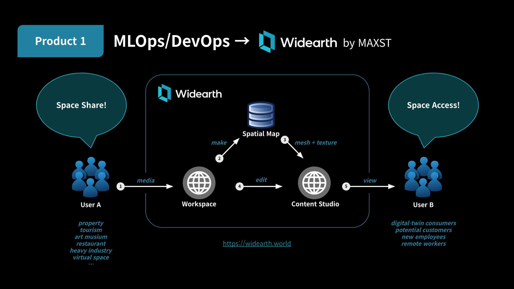
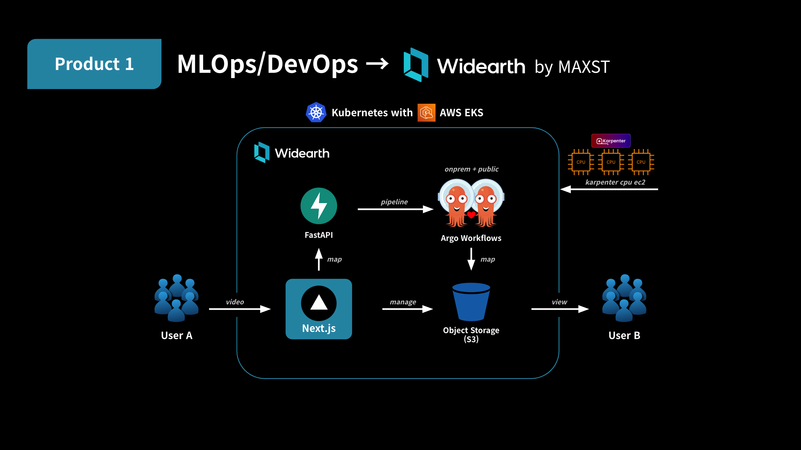
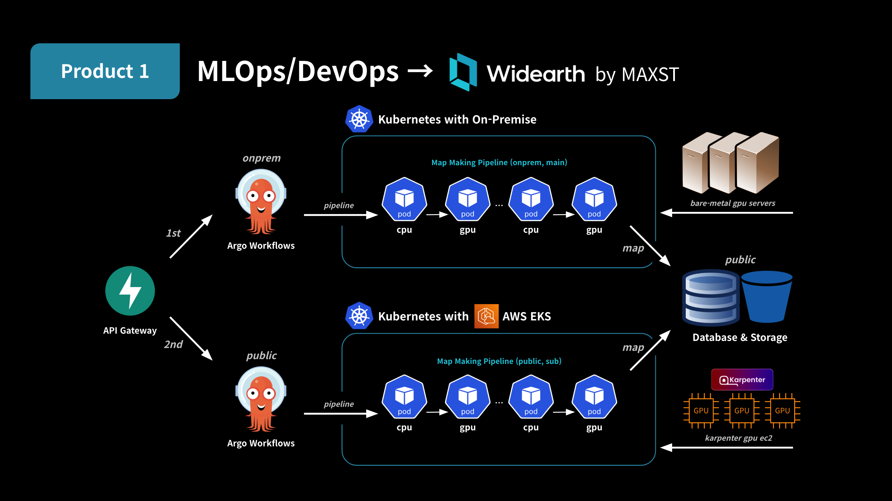

## 요약
- **제목**: **AR & 디지털 트윈 플랫폼 [Widearth] 개발**
- **웹사이트**: [https://widearth.world](https://widearth.world)
- **기간**: **2024년 1월 – 2024년 10월 (10개월)**
- **역할**: **ML/인프라 리드 ~ MLOps/DevOps + ML 백엔드 + SRE [기여도 75%]**
    - **DevOps & SRE**
        - IaC, GitOps, CI/CD 파이프라인, 모니터링, 로깅, 알림, 다중 배포 시나리오, 긴급 대응
    - **하이브리드 클러스터**
        - AWS EKS + Bare Metal Kubernetes, API 게이트웨이 패턴, 동적 인스턴스 관리, GPU 비용 최적화
    - **ML 워크로드**
        - ML API, ML 파이프라인, 데이터 레이크, 도커화, 모델 CI/CD
- **결과: 서비스 성공 출시 ~ 소규모 팀, 전 기능 구현, 가용성 개선, 비용 절감**
    - **서비스 출시**
        - 총 15명(개발자 8명, 인프라 담당 1명)이 기획 및 개발에 참여하여 플랫폼 출시와 운영에 기여
    - **고효율 ML**
        - 하이브리드 클러스터의 온프레미스 인프라에서 ML 파이프라인을 실시간으로 실행. 운영 환경에서 300개 이상의 공간 맵을 생성했으며, 기존 서비스 대비 약 1억 5천만 원(70%)을 절감
    - **고가용성 인프라**
        - 하이브리드 클러스터와 장애 대응을 통해 연간 가용률 96%, 다운타임 14일 이내의 서비스를 구현
- **사용 기술**
    - AWS EKS
    - Kubespray
    - Python/FastAPI
    - Argo Workflows
    - Argo CD
    - Bitbucket Pipelines
    - Karpenter

# 상세 내용

디지털 트윈 플랫폼을 위한 하이브리드 아키텍처를 구성했습니다.

> 내부 보안 규정에 따라 일부 내용은 생략하거나 간략히 서술했습니다.

*Widearth의 운영 흐름 및 사용자 행동 패턴*

Widearth는 디지털 트윈 기술을 활용하여 공간 맵을 생성하는 **B2B2C** 비즈니스입니다. 일반 소비자에게 서비스를 제공하기 전에 주요 고객사를 거치는 플랫폼 비즈니스 형태입니다.

<!-- truncate -->

- 사용자 구분
    - **사용자 A (디지털 트윈 콘텐츠 제공자)**
        - **사용자 A**는 보유한 워크스페이스(1)를 이용해 공간 맵(2)을 생성할 수 있습니다.
        - 생성된 공간 맵은 클라우드에 저장되며, **사용자 A**는 콘텐츠 스튜디오(3)를 통해 이를 공유할 수 있습니다. 공유 대상은 **사용자 B(디지털 트윈 콘텐츠 소비자)**입니다.
        - **사용자 A**는 콘텐츠(4)를 수정하거나 추가하고, 개인정보 보호를 위해 개인정보를 처리할 수도 있습니다.
        - **사용자 A**의 대표 후보군은 **'소통을 통한 공간 공유로 수익을 창출하는 주체'**이며, 예시는 다음과 같습니다:
            - 부동산 / 여행 / 미술관 / 음식점 / 중공업 / 가상 공간 / 장애인 편의시설
            - 이들의 목표는 **'현장을 방문하지 않은 고객의 니즈를 충족하는 것'**입니다.
                - 현장 방문 전 / 방문 후 / 방문이 불가능한 경우 / 현장이 바뀐 경우
    - **사용자 B (디지털 트윈 콘텐츠 소비자)**
        - **사용자 B**는 **사용자 A**가 제공하는 공간 맵 서비스를 이용하는 주체입니다.
        - **사용자 B**의 대표 후보군은 **'소통을 통한 공간 소비로 수익을 창출하는 주체'**이며, 예시는 다음과 같습니다:
            - 잠재적 부동산 소비자 / 잠재적 여행자 / 잠재적 미술관 방문객 / 잠재적 음식점 고객 / 잠재적 입사 지원자 / 가상 공간 이용자 / 장애인 및 보호자
            - 이들은 **사용자 A**로부터 공간 정보를 얻고 서비스를 이용하는 **고객**입니다.

* * *

---

*사용자가 상호작용하는 퍼블릭 클라우드 영역에 해당하는 Widearth 아키텍처*

- 사용자가 상호작용하는 영역으로, 주로 플랫폼의 퍼블릭 클라우드 영역입니다.
- FE/BE/파이프라인을 분리한 MSA(마이크로서비스 아키텍처, 또는 미니 서비스 아키텍처)로 구성되어 있습니다. 각 서비스의 데이터베이스가 엄격하게 분리되어 있지 않으므로 **'미니 서비스 아키텍처'**라고 부르는 것이 더 적절합니다.
- 단일/멀티 클러스터로 운영 가능하며, 모든 서버는 사용량과 환경에 따라 수평 확장이 가능하도록 설계되었습니다.
- 파이프라인은 아래의 하이브리드 아키텍처에서 상세히 설명합니다.

* * *

---

*파이프라인이 동작하는 하이브리드 클라우드 영역에 해당하는 Widearth 아키텍처*

- 파이프라인이 동작하는 영역으로, 온프레미스와 퍼블릭 클라우드를 함께 사용합니다.
- 파이프라인은 온프레미스와 퍼블릭 클라우드에 동일한 스펙으로 구성됩니다. 이를 위해 각 클라우드에 '파일 스토리지'와 '오브젝트 스토리지'를 별도로 구성했습니다.
- 백오피스용 로깅 및 메타데이터 데이터베이스는 가용성과 관리 편의를 위해 퍼블릭 클라우드에만 구성했습니다.
- 파이프라인은 온프레미스 데이터센터의 가용 영역에 우선 할당됩니다. 온프레미스가 응답하지 않거나 모든 영역이 할당된 경우에는 퍼블릭 클라우드에 차순위로 할당하여 파이프라인을 활성화합니다.
    - 온프레미스 데이터센터에 장애/재해가 발생한 경우
    - 요청이 온프레미스 데이터센터의 가용 용량을 초과한 경우
- 퍼블릭 클라우드에는 FE/BE를 서비스하는 클러스터에 파이프라인을 위한 최소한의 자원만 할당합니다. 파이프라인이 퍼블릭 클라우드에 할당되면 노드가 프로비저닝되어 활성화됩니다.

이 하이브리드 아키텍처를 통해 고성능, 고효율, 고가용성을 갖춘 플랫폼을 운영할 수 있었습니다.

[Widearth]: https://widearth.world
