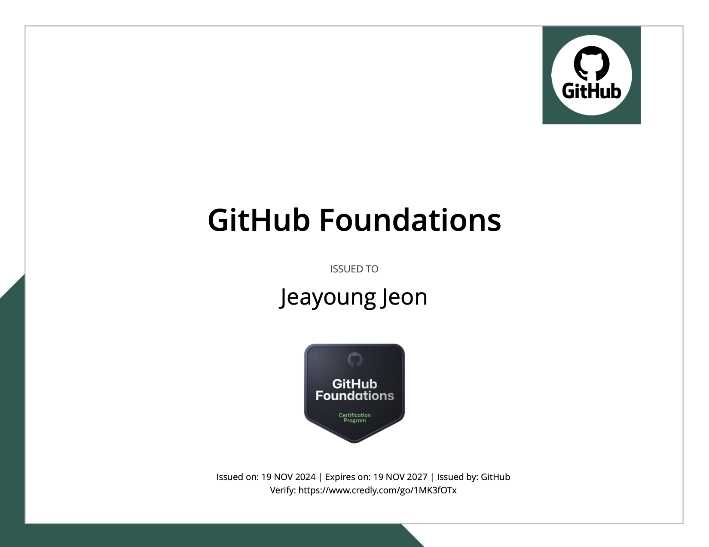

## 1. 자격증 소개

GitHub Foundations 자격증은 기본 Git 작업부터 CodeSpaces 같은 엔터프라이즈 협업 기능까지, GitHub의 기본 구조와 사용법에 대한 핵심 역량을 검증합니다. 이 자격증은 2024년 개발자라면 반드시 알아야 할 필수 GitHub 지식을 다룹니다:

<!-- truncate -->

- 기본 Git 및 GitHub 사용법
- GitHub 고급 기능: Issues, Pull Requests, Projects, Team Management
- 최신 GitHub 제품: CodeSpaces, Copilot
- 엔터프라이즈 기능 및 관리

시험은 120분 안에 75개의 객관식 문제를 풀어야 합니다. 이 중 60문제는 채점 대상이고, 15문제는 미채점 실험 문항입니다. 합격 시 자격증 유효기간은 3년입니다.

## 2. 시험 후기

*GitHub Foundations 자격증 2024. 2024년 11월 19일 발급. 2027년 11월 18일 만료. 자격증 확인은 [여기](https://www.credly.com/badges/876fa6b3-0b27-4ddf-bbb3-a9d853918566)에서 할 수 있습니다.*

주로 두 가지 자료를 활용해 시험을 준비했습니다:

1. [Microsoft Learn - GitHub Foundations](https://learn.microsoft.com/en-us/training/paths/github-foundations) (무료)
   - 풍부한 핸즈온 랩
   - 최신 GitHub 기능이 항상 반영됨
   - GitHub Skills 플랫폼을 통한 실전 연습

2. [LinkedIn Learning - Prepare for the GitHub Foundations Certification](https://www.linkedin.com/learning/paths/prepare-for-the-github-foundations-certification) (유료)
   - 영상 기반 학습
   - 복습과 내용 정리에 적합
   - 엔터프라이즈 기능을 꼼꼼히 다룸

그 외에도 freeCodeCamp에서 시험 내용과 실전 팁을 함께 다루는 훌륭한 무료 종합 영상이 있습니다:

  <iframe width="100%" height="500" src="https://www.youtube.com/embed/Jdc0i7RcBv8" frameborder="0" allowfullscreen></iframe>

이 영상은 시험 형식을 전반적으로 잘 설명해주고, 핵심 개념을 상세하게 풀어줍니다. 특히 시험에서 무엇을 예상해야 할지 파악하는 데 도움이 됩니다.

시험은 GitHub에 대한 기초와 고급 지식을 함께 묻습니다. 대부분의 문제는 GitHub를 익숙하게 사용하는 사람이라면 무난했지만, 엔터프라이즈 관련 문제들은 까다로웠습니다. 시험 인터페이스에서는 다음과 같은 기능을 제공합니다:

- 나중에 검토할 문제 플래그 표시
- 단일 선택 및 복수 선택 문제
- 효율적인 탐색을 위한 키보드 단축키

엔터프라이즈 및 팀 관리 섹션이 특히 어려웠는데, 엔터프라이즈 접근 권한 없이는 이 기능들을 연습하기 어렵기 때문입니다. 그러나 Microsoft Learn 랩을 통한 핸즈온 경험이 자격증의 실무적인 부분에서 큰 도움이 됐습니다.

## 3. 요약

GitHub Foundations 자격증은 GitHub 역량을 검증하고 싶은 개발자에게 좋은 출발점입니다. 경험 많은 사용자에게는 기초적으로 느껴질 수도 있지만, GitHub Copilot, CodeSpaces, 엔터프라이즈 협업 도구처럼 많은 개발자가 놓치기 쉬운 GitHub의 최신 기능들을 폭넓게 다룹니다.

이 자격증을 준비하는 분들에게 권합니다:
- Microsoft Learn 무료 리소스를 최대한 활용하세요
- GitHub Skills 핸즈온 랩으로 실습하세요
- 엔터프라이즈 기능과 팀 관리 개념에 집중하세요
- 자격증 할인 기회를 노려보세요 (가끔 50~100% 할인이 있습니다)

당장 다른 GitHub 자격증을 취득할 계획은 없지만, GitHub Copilot과 GitHub Models를 중심으로 한 GitHub AI 자격증에 관심을 갖고 지켜보고 있습니다. 지금은 검증된 이 역량들을 실제 프로젝트에 적용하고, 다른 분들의 GitHub 여정을 돕는 데 집중하겠습니다.

GitHub Foundations 자격증을 고려하는 분들께 이 글이 도움이 되길 바랍니다. 효과적인 버전 관리와 협업 능력은 현대 소프트웨어 개발의 기본입니다. 이 자격증을 취득하든 안 하든, 이러한 역량을 갖추는 것은 모든 개발자의 커리어 성장에 필수적입니다.
