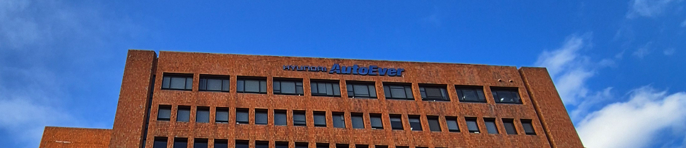

안녕하세요. 2024년부터 2025년까지 정말 많은 일들이 있었습니다. 제 나름대로 회고를 해보려고 합니다.

<!-- truncate -->

## 1. 2024년, 팀과 공동체의 위기

2024년 프로젝트 와이더스를 출시하면서 바쁘게 성장하던 와중에 [회사(맥스트)](/blog/tags/maxst)가 힘들어져 팀을 나오게 되었습니다. 지금 팀에서 좀 더 성장하고 싶었지만, 여러 사정을 숙고해 나가게 되었습니다.
수년간 함께 일하던 동료들과 흩어지게 되었고 다른 팀을 구해야 하는 큰 숙제를 안게 되었습니다.
그래도 오랜만에 찾아온 휴식기를 활용해 건강을 챙기며 여유를 갖고 지원과 인터뷰에 열중했습니다.

- **경력**: 2024년 10월 맥스트 퇴사 / (MLOps/DevOps 엔지니어)
- [프로젝트](/blog/widearth-digital-twins-platforms-at-maxst): 디지털 트윈 플랫폼 와이더스 출시 / (MLOps/DevOps 리드)
- [자격증](/blog/tags/certifications): CKA, CKAD, CAPA, GitHub Foundations 취득
- **도전**: 퇴사 후 재취업 준비 · 회사도 어지러운데, 나라도 어지러운 상황

그리고 12월 한국에 비상계엄이 일어났습니다. 짐작으로는 이 일을 계기로 많은 채용이 중단되고, 불합격 통보를 많이 받게 되었습니다. 제 역량도 부족했지만 정세에 영향도 컸다고 생각합니다. 부족한 부분을 채우기 위해 항상 공부했습니다. 또, 공동체를 지키기 위해 할 수 있는 모든 노력을 다했습니다. 살면서 겪어보지 못할 것 같은--21세기에는 절대 일어나지 않고, 한국사 책에서만 볼 수 있었던--일을 겪으면서 안정적인 나라와 경제력이 없다는 상황이 얼마나 힘든 것인지를 피부로 느끼게 되었습니다.

다행히 소중한 사람들과 가족들이 힘이 되어주어 포기하지 않고 재취업을 위해 힘썼습니다. 12월 마지막 날까지 제가 할 수 있는 일에 최선을 다하였습니다. 거리에서 할 수 있는 최선을 다하였고, 집에서는 회고보다는 이력서를 다듬었습니다. 그렇게 첫 직장에서 퇴사한 해를 마무리하였습니다. 그래도 가족들과 지인들의 도움으로 잘 버티면서 좋은 소식을 기대했습니다.

2024년은 살면서 제일 힘겨웠던 해였습니다. 또한 가장 많은 도움을 받은 해이기도 합니다. 우리를 지켜주신 모든 분들께 감사드립니다. 모두 고생하셨습니다 🤝

## 2. 2025년, 새로운 팀과 성장

2025년은 저에게 회복의 해였습니다. 신기하게도 많은 것들이 빠르게 안정되었습니다.
이렇게 지난 날을 회고할 수 있음에 감사합니다.

- **경력**: 2025년 2월 현대오토에버 개발환경플랫폼팀 합류 / (AI/MLOps 엔지니어)
- **프로젝트**: 코드비머 AI 어시스턴트 PoC / (AI 아키텍트)
- [자격증](/blog/tags/certifications): KCNA, KCSA 취득 / (CKS는 26년 상반기 취득 목표)
- **도전**: 첫 이직 후 적응하면서 성과내기 · 생성형 AI 프로젝트 실무 및 테크 리드 · 향후 생성형 AI 프로젝트 확장 추진

### 2.1. 새로운 팀, 새로운 동료들

2월 초 합격 통보 및 합류 결정을 하고 나서야 숨을 돌릴 수 있었습니다. 저의 경험과 잠재력을 높이 평가해주셔서 감사합니다.

2025년 2월 **[현대오토에버] 개발환경플랫폼팀**에 합류했습니다. 현대자동차 그룹의 ICT 회사로, 기쁘게도 대학원에서 몰입했던 오토모티브 분야로 다시 돌아오게 되었습니다. 우리 팀은--제가 연구원 시절 경험했던--자동차 기술개발에 대한 소프트웨어 개발환경을 지원하는 부서입니다.

대기업이라 안정적인 체계 위에서 새롭고 과감한 시도를 할 수 있습니다. 다만 과제가 성숙해지면서 개인이 업무에 종속되는 락인 효과가 강하게 발생합니다. 성장을 위해서는 안정성을 올리면서도 스타트업에 있을 때 보다 더 많은 도전을 해야 합니다.

좋은 동료들을 만나게 되었습니다. 전 직장은 비슷한 경력과 나이의 동료들이 많았지만, 새 팀은 모든 구간의 동료들이 있어 다양한 경험을 공유할 수 있었습니다. 모두 여유 있고 전문성이 높은 동료들이었습니다. 동료들의 도움으로 빠르게 적응할 수 있었습니다. 커피를 정말 많이 마셨습니다 ☕️.

개발환경플랫폼팀은 현대자동차그룹에서 차량용 SW 개발을 위한 협업도구를 공급하는 조직입니다.

- Codebeamer와 같은 요구사항과 이슈, 테스트를 통합관리하는 Application Lifecycle Management(ALM) 상용 도구,
- GitLab, Jira, Confluence와 같은 대중적인 SW 협업 상용 도구,
- [BitWinHub](https://blog.naver.com/hyundai-autoever/223405344548)라는 SW 개발 플랫폼 연계 자동화 도구 (자체 개발)

등의 툴체인을 제공합니다.

제가 대학원 시절부터 많이 접했던 차량분야와 사람과 플랫폼을 지원하는 DevOps 분야를 함께 접할 수 있게 되었습니다. 다른 면접에서는 조각조각 평가받던 경험들이 여기서는 모두 현업에 도움이 되는 경력으로 잘 정리되었습니다. 인정해 주신 만큼 새로운 회사에 잘 기여하고 싶어졌습니다.

지금까지 10개월 동안 수천 명이 함께 일하는 그룹사의 문화를 익힐 수 있었고, 저의 경험을 공유하며 팀에 나름 기여할 수 있었습니다. 오랜 역사의 제조업 기반 회사이기 때문에 기민하게 움직이는 스타트업과 다른 스케일과 장단점이 있었습니다. 팀원들의 자부심과 고충도 많이 듣게 되었습니다. 제가 제안하는 아이디어와 인사이트를 잘 들어주셔서 매우 뿌듯했습니다.

### 2.2. 새로운 역할, 새로운 프로젝트

저는 **중간급 엔지니어**로 합류하였습니다. DevOps와 생성형 AI의 경험을 바탕으로 팀의 플랫폼 유지/개선의 역할을 맡게 되었습니다. 약간의 적응기간 이후에 실무조정을 하는 과정에서 **생성형 AI 프로젝트**에 집중하는 것으로 역할을 구체화했습니다. 또한 라이브 서비스를 지향하고 있기 때문에 이미 보유한 DevOps 역량도 유용하게 쓰였습니다. (이후에 1인 다역을 해주어서 좋았다는 피드백을 받았습니다)

10명이 넘는 파트, 4명으로 된 그룹에 합류했습니다. 처음으로 맡은 프로젝트는 '**코드비머를 지원하는 AI 어시스턴트의 PoC 추진**'이었습니다.
4인 그룹으로 다음의 업무를 함께 진행했습니다:

- 대상 플랫폼과 생성형 AI 기술 검토
- AI 에이전트 개발 및 UI 설계
- 데이터 전처리 및 지식기반 학습 파이프라인 구성
- 코드리뷰, CI/CD 및 모니터링 구성

저는 AI 아키텍트로서 생성형 AI 프로젝트 경험이 적은 팀원들과 함께 프로젝트를 진행하면서 팀원들에게 제 경험을 공유하고 함께 성장할 수 있었습니다. 이 과정에서 프로젝트 추진의 어려움, 기술적 어려움을 잘 극복하였습니다. 6개월 정도 실무 진행을 하고 사내 베타테스트까지 진행하였고 PoC를 잘 마무리 했습니다. 2026 진행할 AI 프로젝트의 추진을 위한 기획 능력과 기술 스택을 확보했습니다.

### 2.3. 첫 이직의 부담감

입사 초기부터 너무 잘하려고 하지 말아라고 조언해주시던 동료도 있었고, 저도 가면 증후군에 빠지기 쉬운 사람이란 걸 알고 있었습니다. 하지만 어느새 무리한 루틴을 반복하고 있었습니다. 새벽에 일어나 버스에서 공부하면서 출근했고, 여러 일을 제안하고 추진했습니다. 좋은 동료가 되기 위해 소통하고 피드백을 요청했습니다. 퇴근하고도 집에서 할 수 있는 일거리를 찾아서 했습니다.

이건 성장하는 직장인이 하기 좋은 루틴이지만 정도가 심했던 것 같습니다. 2025년 상반기를 이렇게 생활하고 나니 좋은 첫인상을 남길 수 있었고 성과도 안정적으로 나왔습니다. 연말에도 긍정적인 피드백을 받았지만 짧은 기간 몸이 다소 망가져 있었습니다. 갈수록 참여 프로젝트와 업무 요청은 더 많아질 것이므로, 힘조절이 꼭 필요합니다.

최근에는 생성형 AI를 활용한 업무 자동화로 같은 시간에 더 많은 일을 하려고 노력하고 있습니다. 일찍 출근하고, 일찍 퇴근해야죠.

### 2.4. 아쉬운 점과 나아갈 점

작년 AI 프로젝트를 진행하면서 단기간에 성공적인 GenAI 서비스 개발 사이클을 구현할 수 있었습니다. 물론 약간의 아쉬운 점들이 있었습니다.

- **⏩ 속도가 생명**: AWS 'innovate faster'
- **📝 결과로 검증**: 기술적인 기술 검증은 포트폴리오로 확보하겠습니다
- **🤝 협업**: 과감하게 협업에 필요한 일회용 도구를 개발하겠습니다

개인 역량에서 이 점들을 보완한다면 훌륭한 프로젝트 수행과 협업을 할 수 있을 것이라 생각합니다:

1. **실행은 빨랐지만 완성도에 집착했습니다.**
    - **이슈:** 초기 기획의 구현은 빠르게 완성되었지만, 결과 개선을 위해 기존 프레임워크를 고도화시키는 것에 고수했습니다.
    - **해결책:** 유연한 기획을 만들고 데이터를 기반으로 빠르게 기획을 수정합니다.
    - **예시:** 지식기반 재구성, 기술 스택 변경 등
    - **앞으로의 방향:** AWS의 'innovate faster'를 참고하며 빠르게 개선할 수 있는 기획과 구현을 수행합니다.
2. **결과를 통해 설득하는 과정이 부족했습니다.**
    - **이슈:** 기존 기획을 넘어서는 기술적인 의사결정이 필요한 순간에 팀원들에게 보여줄 구현체가 없었습니다. 이를 미리 준비하지 않아 의사결정에 시간이 많이 소요되었습니다.
    - **해결책:** RAG, MCP, A2A 등의 AI 기술들을 접할 때 미리 예시를 확보합니다. 
    - **예시:** 사내 클라우드에서 실제 동작하는 기술 포트폴리오 구성
    - **앞으로의 방향:** 기술 포트폴리오를 구성하고 꾸준히 갱신합니다. 그럼 의사 결정의 도구로 쓸 수 있고, 온보딩 자료로도 쓸 수 있습니다.
3. **협업을 위한 UX를 더 잘할 수 있었습니다.**
    - **이슈:** 데이터 처리 및 평가를 위한 코드는 잘 작성했지만, 이를 공유하고 피드백을 받을 수 있는 UI를 제작하지 않았습니다. 따라서 결과 리포트에만 의존하고 실시간으로 결과를 공유하기 어려운 구조가 되었습니다. 작은 공유에도 소스코드를 새로 빌드하는 시간이 소요되었습니다.
    - **해결책:** AI로 쉽게 일회용 앱을 만들 수 있습니다. 빠른 협업과 의사결정을 위해 FE/BE/DB를 설계할 수 있습니다.
    - **예시:** 지식기반 검색성능 평가 UI, 전문가 평가를 위한 UI, AI  
    - **앞으로의 방향:** 과감하게 협업에 필요한 일회용 도구를 개발하겠습니다. 기존보다 생산성이 3~4배 오를 것이라 기대합니다.

## 3. 마무리: 앞으로 이렇게 성장할 거예요

작년(2025년)에 했던 것을 계속 반복할 계획입니다. 새로 합류한 팀에서 차량 SW 도메인 지식을 익히고 실무와 협업에 더 노련해지는 것입니다. 또 생성형 AI를 팀과 회사에 더 알리고 업무에 적용해서 능률을 무한히 확장할 계획입니다.

- **💪 업무 숙달**: 차량SW개발 도메인에서 생성형 AI와 LLMOps 플랫폼에 전문성을 키우고, 실무와 협업 능력을 더 키우고 싶습니다.
- **🦾 생성형 AI 활용**: 생성형 AI 활용법을 팀과 회사에 더 알리고 업무에 적용해서 능률을 무한히 확장합니다.
- **🤝 협업**: 매일 매일 함께 일하기 좋은 동료가 되려고 노력하겠습니다.
- **🏥 건강 관리**: 오래 일하기 위해 꾸준한 운동을 꼭 하겠습니다.

저는 항상 일하고 기술적 문제를 직접 해결하는 스태프 엔지니어를 꿈꾸기 때문에 꾸준히 학습하고 교류하여 실무능력을 유지할 것입니다. 저에게 오는 기회를 감사히 잘 수행하겠습니다. 또 좋은 기회를 나누고 함께 성장하겠습니다. 혼자 일할 수는 없으니까요. 매일 매일 함께 일하기 좋은 동료가 되려고 노력하겠습니다. 그러기 위해서는 건강도 잘 챙겨야겠죠. 올해(2026년)는 꾸준한 운동을 꼭 하겠습니다.

읽어주셔서 감사합니다.

[현대오토에버]: /blog/tags/hyundai-autoever "현대오토에버 관련 글"
